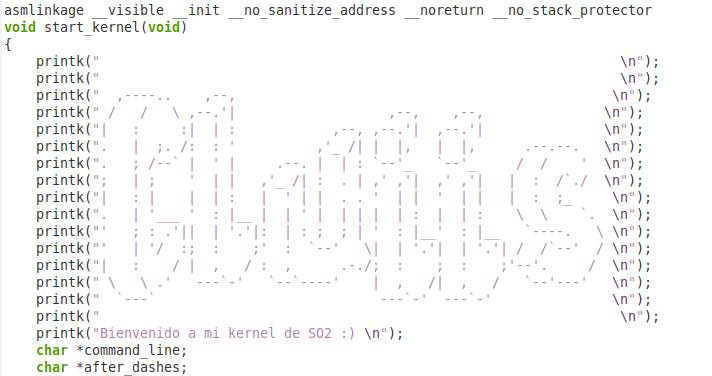
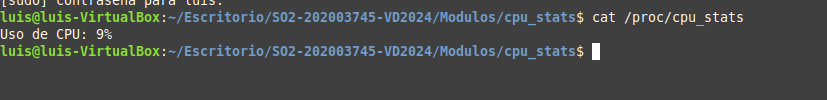

# SO2-202003745-VD2024

## Descripción del proyecto

En el ámbito de los sistemas operativos, la capacidad de personalizar y expandir el kernel permite a los desarrolladores ajustar el funcionamiento del sistema a necesidades específicas.
Este proyecto aborda el desarrollo de nuevas funcionalidades en el kernel de Linux, brindando la oportunidad de entender su estructura y funcionamiento interno, además de aprender a trabajar con módulos y llamadas al sistema personalizadas.

Las personalizaciones estarán limitadas a aspectos específicos como la modificación
del nombre del sistema, mensajes de arranque y el desarrollo de módulos para obtener estadísticas del sistema. No se espera una modificación extensa del sistema operativo ni el desarrollo de nuevas arquitecturas o drivers avanzados.

## Requisitos del proyecto

- Entorno de ejecución para máquinas virtuales

- Linux mint 

## Configuración del entorno para la realización del proyecto

Para poder realizar este proyecto, se hizo uso de una máquina virtual, la cual tiene linux mint (versión cinamon), a continuación se explicará cuál es la mejor configuración para poder realizar este proyecto correctamente.

#### Configuración para la maquina virtual

Se recomienda darle los siguientes requisitos a la máquina virtual:


Para evitar cualquier inconveniente también se recomienda darle un tamaño de 40gb, así podremos compilar el kernel perfectamente. 

#### Versión del kernel

Para realizar este proyecto se descargo la versión *6.8*, la cual fue descargada en kernel.org.

#### Recomendación para copiar y pegar

Para poder copiar entre nuestra máquina host y anfitrion, existen dos opciones.

- Conectase mediante ssh.

- Instalar guest additions de vbox.

# Compilar el kernel (Si es por primera vez)

## Descargar y descomprimir el código fuente del kernel

```bash
wget https://cdn.kernel.org/pub/linux/kernel/v6.x/linux-6.8.tar.xz
```

Descargar el archivo del kernel desde `kernel.org`.

```bash
tar -xvf linux-6.8.tar.xz
```

Descomprimir el archivo descargado.

---

## Instalar las dependencias necesarias

```bash
sudo apt-get install build-essential libncurses5-dev fakeroot wget bzip2 openssl
sudo apt-get install build-essential libncurses-dev bison flex libssl-dev libelf-dev
```

Instalar las herramientas y librerías requeridas para compilar el kernel.

---

## Preparar el entorno de compilación

Ejecutar los siguientes comandos en el directorio del código fuente del kernel como usuario root:

### Copiar el archivo de configuración existente

```bash
cp -v /boot/config-$(uname -r) .config
```

Copiar la configuración actual del kernel al directorio de compilación.

### Limpiar el ambiente de compilación

```bash
make clean
```

Eliminar archivos generados previamente en caso de haberlos.

### Modificar la versión del kernel en el archivo Makefile

Editar el archivo `Makefile` en la raíz del directorio del código fuente y modificar la línea:

```make
EXTRAVERSION =
```

Cambiándola a algo como:

```make
EXTRAVERSION = -49-usac1
```

Esto agrega una etiqueta personalizada a la versión del kernel.

---

## Configurar el kernel

### Crear la configuración inicial basada en el archivo copiado

```bash
make oldconfig
```

Se recomienda presionar **Enter** en todas las opciones que aparezcan.

### Crear configuraciones locales para los módulos

```bash
make localmodconfig
```

Esto optimiza el kernel configurando sólo los módulos necesarios para el hardware presente en la máquina.

### Deshabilitar certificados de firma oficiales de Canonical

```bash
scripts/config --disable SYSTEM_TRUSTED_KEYS
scripts/config --disable SYSTEM_REVOCATION_KEYS
```

Esto deshabilita las claves de firma que podrían generar problemas durante la compilación.

---

## Compilar e instalar el kernel

### Crear un script para compilar e instalar

Ejecutar el archivo `compile_and_install.sh` 

Marcar el archivo como ejecutable:

```bash
chmod +x compile_and_install.sh
```

Ejecutar el script:

```bash
./compile_and_install.sh
```

Presionar **Enter** en todas las opciones de configuración que aparezcan durante el proceso.

---

## Finalizar la instalación

Si el script no actualiza automáticamente la configuración del gestor de arranque, ejecutar:

```bash
sudo update-grub2
```

Reiniciar la máquina virtual. Mantener presionada la tecla **Shift** al iniciar para acceder al menú del gestor de arranque y seleccionar el nuevo kernel.

---

## Debug

Si el kernel no aparece en la lista del gestor de arranque o no inicia, intentar:

```bash
sudo update-grub2
```

## 1.2 Reecompilar el kernel

Para volver a compilar el kernel, no es necesario volver a realizar todos los pasos, lo único para volver a compilar el kernel, cuando hayamos hecho cambios, solo debe ejecutarse el archivo compile.sh.

# 2. Código fuente del kernel modificado

## 2.1 Personalización del nombre del sistema

Para la personalización del nombre del sistema, es necesario irse al siguiente archivo: 

```
/home/luis/Escritorio/linux-6.8/include/linux
```

Una vez en ese archivo, mostrará el siguiente contenido:

```C
/* SPDX-License-Identifier: GPL-2.0 */
#ifndef _LINUX_UTS_H
#define _LINUX_UTS_H

/*
 * Defines for what uname() should return 
 */
#ifndef UTS_SYSNAME
#define UTS_SYSNAME "Linux"
#endif

#ifndef UTS_NODENAME
#define UTS_NODENAME CONFIG_DEFAULT_HOSTNAME /* set by sethostname() */
#endif

#ifndef UTS_DOMAINNAME
#define UTS_DOMAINNAME "(none)"    /* set by setdomainname() */
#endif

#endif
```

Para cambiar el nombre debemos cambiar la siguiente línea:

```
#define UTS_SYSNAME "Linux"
```

al nombre que queremos cambiar, por ejemplo:

```
#define UTS_SYSNAME "Linux SO2_USAC"
```

Una vez realizado estos pasos, volviendo a recompilar debe salirnos el nombre del sistema al que cambiamos.

## 2.2 Mensajes personalizados

Para poder mostrar mensajes personalizados en nuestro kernel al momento del arranque del sistema debemos modificar el archivo que se encuentra en la siguiente ruta:

```
/home/luis/Escritorio/linux-6.8/init/main.c
```

Una vez en este archivo, buscaremos la función start_kernel, una vez hayamos encontrado esa función, modificaremos lo que queremos que nos salga al inicio, por ejemplo debería de quedar una función como se muestra en la siguiente imagen:



Una vez realizado estos pasos, con el comando 

```bash
dmesg 
```

nos debe salir al inicio el mensaje personalizado que introdujimos, de la siguiente manera:


# 3. Implementación de nuevas syscalls

Mediante el uso de las syscalls, se implementaron nuevas llamadas, las cuales son las siguientes:

- capture_memory_snapshot

- track_syscall_usage

- get_io_throttle

A continuación se describirá el funcionamiento de cada una, pero antes se dará una breve explicación de como es su implementación en general:

## 3.1 Como implementar las syscalls

### 3.1.1 Modificar el archivo syscall64.tbl

En este archivo veremos todas las llamadas al sistema, después de ver los comentarios procederemos a agregar nuestras llamadas para que queden de la siguiente manera:


Estas llamadas se desglosan en 3 parametros que son los siguientes:

- **Número de syscall**: El número (como `548`, `549`, `550`) es un identificador único para cada syscall, usado por el sistema operativo para saber qué función ejecutar en el kernel cuando se invoca desde el espacio de usuario.

- **`common`**: La palabra `common` indica que la syscall es común a todas las arquitecturas soportadas, no específica de una arquitectura (como `x86_64` o `arm64`), por lo que está disponible en múltiples plataformas.

- **Dos nombres**: El primer nombre (como `luis_capture_memory_snapshot`) es el nombre accesible desde el espacio de usuario, mientras que el segundo nombre (como `sys_luis_capture_memory_snapshot`) es el nombre interno en el kernel, siguiendo la convención de prefijar con `sys_` para funciones de syscall.

### 3.1.2. Modificar el archivo syscalls.h

En el archivo `syscalls.h`, se definen las declaraciones de las funciones de las syscalls del kernel, como:


- **`asmlinkage`**: Es un modificador que indica cómo se debe hacer la llamada a la función en el contexto de ensamblador y el sistema de llamadas al kernel. Garantiza que los parámetros se pasen de manera adecuada al kernel desde el espacio de usuario.

- **`long`**: Tipo de retorno de la syscall, que generalmente indica un valor de estado o error.

- **`__user`**: Especifica que los punteros son del espacio de usuario, y se utiliza para asegurar que los datos se copien correctamente entre el espacio de usuario y el del kernel.

### 3.1.3 Realizar nuestras definiciones en el sys.c

En el archivo sys.c procederemos a realizar nuestras definiciones, un ejemplo sería el siguiente: 

```c
#include <linux/kernel.h>
#include <linux/syscalls.h>
#include <linux/uaccess.h>

SYSCALL_DEFINE1(get_system_memory_size, unsigned long __user *, user_memory_size)
{
    unsigned long memory_size;


    memory_size = totalram_pages() * PAGE_SIZE;


    if (!access_ok(user_memory_size, sizeof(memory_size)))
        return -EFAULT;


    if (copy_to_user(user_memory_size, &memory_size, sizeof(memory_size)))
        return -EFAULT;

    return 0; 
}
```

Este es un ejemplo base, no es una definición de las syscalls descritas anteriormente, los puntos importantes en este ejemplo son los siguientes:

**`SYSCALL_DEFINE1`**: Macro usada para definir una syscall que toma un argumento. El número `1` indica que esta syscall tiene un argumento.

- `get_system_memory_size`: Es el nombre de la syscall.
- `unsigned long __user *, user_memory_size`: El argumento que toma la syscall, un puntero al espacio de usuario donde se almacenará el tamaño de la memoria.
- **`access_ok` y `copy_to_user`**: Son funciones del kernel que se aseguran de que los punteros de usuario sean válidos y luego copian los datos desde el kernel al espacio de usuario.

## 3.2 Explicacion de las syscalls y sus definiciones

### 3.2.1 Capture_memory_snapshot

Esta llamada accede a la tabla de páginas del sistema y devuelve detalles estructurados del uso de memoria (páginas activas, caché, swap, etc.). Para esta implementación, los estudiantes deben entender el manejo de tablas de páginas dentro del kernel y desarrollar estructuras que recopilen y organicen esta información en un formato fácil de interpretar.

##### Definición en sys.c

En sys.c se implemento lo siguiente:

```c
struct memory_snapshot {
    unsigned long total_mem_kb;
    unsigned long free_mem_kb;
    unsigned long cached_mem_kb;  // Memoria en caché
    unsigned long dirty_page_count;  // Páginas sucias
    unsigned long slab_mem_kb;  // Memoria slab total
    unsigned long reclaimable_slab_mem_kb;  // Slab que puede reclamarse
    unsigned long active_page_count;
    unsigned long inactive_page_count;
    unsigned long total_swap_kb;
    char snapshot_date[36]; 
};

SYSCALL_DEFINE1(luis_capture_memory_snapshot, struct memory_snapshot __user *, user_snapshot)
{
    struct memory_snapshot local_snapshot;
    struct sysinfo sys_info;
    struct timespec64 ts;
    struct tm tm;


    if (!user_snapshot)
        return -EINVAL;


    si_meminfo(&sys_info);

    local_snapshot.total_mem_kb = sys_info.totalram << (PAGE_SHIFT - 10);
    local_snapshot.free_mem_kb = sys_info.freeram << (PAGE_SHIFT - 10);
    local_snapshot.cached_mem_kb = sys_info.bufferram << (PAGE_SHIFT - 10); // Usar bufferram como caché
    local_snapshot.total_swap_kb = sys_info.totalswap << (PAGE_SHIFT - 10);


    local_snapshot.active_page_count = global_node_page_state(NR_ACTIVE_ANON) +
                                       global_node_page_state(NR_ACTIVE_FILE);
    local_snapshot.inactive_page_count = global_node_page_state(NR_INACTIVE_ANON) +
                                         global_node_page_state(NR_INACTIVE_FILE);
    local_snapshot.dirty_page_count = global_node_page_state(NR_FILE_DIRTY);


    local_snapshot.slab_mem_kb = global_node_page_state(NR_SLAB_UNRECLAIMABLE_B) << (PAGE_SHIFT - 10);
    local_snapshot.reclaimable_slab_mem_kb = global_node_page_state(NR_SLAB_RECLAIMABLE_B) << (PAGE_SHIFT - 10);


    ktime_get_real_ts64(&ts);
    time64_to_tm(ts.tv_sec, 0, &tm);
    snprintf(local_snapshot.snapshot_date, sizeof(local_snapshot.snapshot_date),
         "%04ld-%02d-%02d %02d:%02d:%02d UTC",
         tm.tm_year + 1900, tm.tm_mon + 1, tm.tm_mday,
         tm.tm_hour, tm.tm_min, tm.tm_sec);

    // Copiar los datos al espacio de usuario
    if (copy_to_user(user_snapshot, &local_snapshot, sizeof(local_snapshot)))
        return -EFAULT;

    return 0;
}
```

Explicación del funcionamiento y sus puntos más importantes:

- **Estructura de la Syscall**
  
  - **Entrada del usuario:** La syscall recibe un puntero de tipo `struct memory_snapshot` que se llenará con datos del sistema.
  - **Validación inicial:** Si el puntero proporcionado es inválido (`NULL`), retorna el error `-EINVAL`.
  - **Uso de `si_meminfo`:** Obtiene información global del sistema, como memoria total (`totalram`), memoria libre (`freeram`), y swap total (`totalswap`), y los convierte a kilobytes utilizando `PAGE_SHIFT`.

- **Cálculo de métricas**
  
  - **Páginas activas e inactivas:** Usando `global_node_page_state` con contadores `NR_*`, como:
    - `NR_ACTIVE_ANON` y `NR_ACTIVE_FILE` para páginas activas.
    - `NR_INACTIVE_ANON` y `NR_INACTIVE_FILE` para páginas inactivas.
  - **Páginas sucias:** `NR_FILE_DIRTY` indica el número de páginas modificadas que aún no se escriben en disco.
  - **Memoria slab:** Se divide en:
    - `NR_SLAB_UNRECLAIMABLE_B`: Memoria slab no recuperable.
    - `NR_SLAB_RECLAIMABLE_B`: Memoria slab que puede ser liberada.

- **Uso de `PAGE_SHIFT`**
  
  - `PAGE_SHIFT` representa el tamaño de las páginas de memoria en bits (por ejemplo, 12 para páginas de 4 KB).
  - Al desplazar `PAGE_SHIFT - 10`, se convierte de páginas a kilobytes:
    - Ejemplo: `sys_info.totalram << (PAGE_SHIFT - 10)` multiplica el número de páginas por 4 para obtener el tamaño en KB.

- **Generación de la fecha del snapshot**
  
  - Usa `ktime_get_real_ts64` para obtener el tiempo actual del sistema en segundos.
  - Convierte el tiempo a una estructura de fecha/hora (`tm`) con `time64_to_tm`.
  - Formatea la fecha como una cadena con `snprintf`.

- **Copia al espacio de usuario**
  
  - Copia los datos recolectados al espacio de usuario utilizando `copy_to_user`.

### 3.2.2 Implementación de track_syscall_usage

Se debera modificar la tabla de llamadas del sistema y realizar un rastreo de cada una de las llamadas seleccionadas (open, read, write, fork). La implementación incluye interceptar estas llamadas en tiempo de ejecución, contabilizar el número de veces que se llaman y almacenar la información en estructuras internas que pueden consultarse.

#### Implementación en sys.c

```c
struct track_counters {
    long counter_open;
    long counter_read;
    long counter_write;
    long counter_fork;
};

SYSCALL_DEFINE1(luis_track_syscall_usage, struct track_counters __user *, trackers)
{
    struct track_counters local_trackers;

    local_trackers.counter_write = write_call_counter;
    local_trackers.counter_read = read_call_counter;
    local_trackers.counter_open = open_call_counter;
    local_trackers.counter_fork = fork_call_counter;


    if (copy_to_user(trackers, &local_trackers, sizeof(local_trackers)))
        return -EFAULT;

    return 0;
};
```

- **Parámetro de entrada:**  
  Recibe un puntero de tipo `struct track_counters` que apunta a una estructura en el espacio de usuario para almacenar los contadores.

- **Inicialización de datos locales:**  
  Se crea una instancia local de `struct track_counters` llamada `local_trackers`, donde se almacenarán los valores de los contadores del kernel.

- **Asignación de contadores:**  
  Los campos de `local_trackers` son llenados con los valores actuales de contadores globales (como `write_call_counter`, `read_call_counter`, etc.).
  
  - Estos contadores son variables globales que se actualizan en otras partes del kernel cuando las correspondientes syscalls son ejecutadas.
  
  - Estos contadores dependiendo la llamada se actualizan en open.c, read_write.c y fork.c, un ejemplo de la implementación de uno de estos es el siguiente:
  
  - ```c
    long open_call_counter = 0;  // Variable global para el contador
    EXPORT_SYMBOL(open_call_counter);
    long do_sys_open(int dfd, const char __user *filename, int flags, umode_t mode)
    {
        open_call_counter++; // aumento del contador
        struct open_how how = build_open_how(flags, mode);
        return do_sys_openat2(dfd, filename, &how);
    }
    ```

### 3.2.3 Implementación del get_io_throttle

Este código define una syscall llamada `luis_get_io_throttle`, cuyo objetivo es capturar estadísticas de I/O (entrada/salida) de procesos activos en el sistema.

```c
struct io_stats {
    pid_t pid;  
    char comm[18];  
    unsigned long long bytes_read;  
    unsigned long long bytes_written;  
    unsigned long long cancelled_write_bytes;  
    unsigned long long io_wait_time;  
};

struct all_io_stats {
    struct io_stats stats[MAX_PROCS];
    int num_procs;
};

SYSCALL_DEFINE1(luis_get_io_throttle, struct all_io_stats __user *, user_stats)
{
    struct task_struct *task;
    struct all_io_stats kernel_stats;
    int i = 0;

    rcu_read_lock();
    for_each_process(task) {

        unsigned long long read_bytes = task->ioac.read_bytes;
        unsigned long long write_bytes = task->ioac.write_bytes;


        if (read_bytes == 0 && write_bytes == 0) {
            continue;
        }

        if (i >= MAX_PROCS) {
            break;
        }


        kernel_stats.stats[i].pid = task->pid;
        strncpy(kernel_stats.stats[i].comm, task->comm, sizeof(kernel_stats.stats[i].comm) - 1);
        kernel_stats.stats[i].comm[sizeof(kernel_stats.stats[i].comm) - 1] = '\0';  
        kernel_stats.stats[i].bytes_read = read_bytes;
        kernel_stats.stats[i].bytes_written = write_bytes;
        kernel_stats.stats[i].cancelled_write_bytes = task->ioac.cancelled_write_bytes;
        kernel_stats.stats[i].io_wait_time = task->se.sum_exec_runtime - task->se.vruntime;
        i++;
    }
    kernel_stats.num_procs = i;
    rcu_read_unlock();


    if (!access_ok(user_stats, sizeof(kernel_stats))) {
        return -EFAULT;
    }

    // Copiar los datos al espacio de usuario
    if (copy_to_user(user_stats, &kernel_stats, sizeof(kernel_stats))) {
        return -EFAULT;
    }

    return 0;
}
```

### **Funcionamiento de la syscall**

1. **Inicio de la syscall (`SYSCALL_DEFINE1`):**
   
   - **Parámetro de entrada:**  
     Recibe un puntero `user_stats` a una estructura `all_io_stats` ubicada en el espacio de usuario, donde se copiarán los datos.

2. **Bloqueo de lectura de RCU (`rcu_read_lock`):**
   
   - Asegura que el acceso a la lista de procesos sea seguro durante la iteración.

3. **Iteración sobre procesos (`for_each_process`):**
   
   - Recorre todos los procesos activos en el sistema mediante la lista global de procesos (`task_struct`).

4. **Obtención de estadísticas por proceso:**
   
   - Se obtienen los bytes leídos y escritos del proceso (`task->ioac.read_bytes` y `task->ioac.write_bytes`).
   - Si ambos valores son 0, el proceso es ignorado, ya que no ha realizado operaciones de I/O.
   - Los datos son almacenados en `kernel_stats.stats[i]`:
     - `pid` y `comm`: ID y nombre del proceso.
     - `bytes_read`, `bytes_written`, y `cancelled_write_bytes`: Estadísticas relacionadas con el uso de I/O.
     - `io_wait_time`: Calculado como la diferencia entre `sum_exec_runtime` (tiempo total de ejecución) y `vruntime` (tiempo virtual ejecutado). Esto representa el tiempo total que el proceso esperó en operaciones de I/O.

5. **Límite máximo de procesos (`MAX_PROCS`):**
   
   - La syscall se detiene si se alcanza este límite para evitar desbordamientos del arreglo.

6. **Liberación del bloqueo de RCU (`rcu_read_unlock`):**
   
   - Finaliza la sección protegida después de completar la iteración.

# 4. Módulos del kernel

Se crearon tres módulos de kernel para poder obtener las siguientes estádisticas.

- **Estadísticas de CPU:** El módulo debe obtener y registrar el porcentaje de uso de CPU.

- **Estadísticas de memoria:** Debe mostrar el uso actual de memoria total y memoria disponible.

- **Estadísticas de almacenamiento:** Muestra el espacio total y el espacio libre en el disco, específico a una partición indicada.

A continuación se mostrará el código para cada una de los módulos implementados y una breve explicación.

## 4.1 Estadísticas del CPU

```c
#include <linux/module.h>
#include <linux/kernel.h>
#include <linux/init.h>
#include <linux/proc_fs.h>
#include <linux/seq_file.h>
#include <linux/sched.h>
#include <linux/fs.h>
#include <linux/statfs.h>

#define AUTHOR "Luis Antonio Castillo Javier"
#define DESCRIPTION "Módulo para monitorear estadísticas de CPU"
#define MODULE_NAME "cpu_stats"

MODULE_LICENSE("GPL");
MODULE_AUTHOR(AUTHOR);
MODULE_DESCRIPTION(DESCRIPTION);
MODULE_VERSION("1.0");

static unsigned long long prev_idle_time = 0, prev_total_time = 0;

static unsigned long long get_cpu_idle_time(void) {
    struct file *file;
    char buffer[128] = {0};
    ssize_t bytes_read;
    unsigned long long idle, iowait;

    file = filp_open("/proc/stat", O_RDONLY, 0);
    if (IS_ERR(file)) {
        pr_err("No se pudo abrir /proc/stat\n");
        return -1;
    }

    bytes_read = kernel_read(file, buffer, sizeof(buffer) - 1, &file->f_pos);
    filp_close(file, NULL);

    if (bytes_read <= 0) {
        pr_err("No se pudo leer /proc/stat\n");
        return -1;
    }

    buffer[bytes_read] = '\0'; // Aseguramos terminación de la cadena

    if (sscanf(buffer, "cpu  %*llu %*llu %*llu %llu %llu %*llu %*llu %*llu",
               &idle, &iowait) != 2) {
        pr_err("Error al parsear /proc/stat\n");
        return -1;
    }

    return idle + iowait;
}

static unsigned long long get_cpu_total_time(void) {
    struct file *file;
    char buffer[128] = {0};
    ssize_t bytes_read;
    unsigned long long user, nice, system, idle, iowait, irq, softirq, steal;

    file = filp_open("/proc/stat", O_RDONLY, 0);
    if (IS_ERR(file)) {
        pr_err("No se pudo abrir /proc/stat\n");
        return -1;
    }

    bytes_read = kernel_read(file, buffer, sizeof(buffer) - 1, &file->f_pos);
    filp_close(file, NULL);

    if (bytes_read <= 0) {
        pr_err("No se pudo leer /proc/stat\n");
        return -1;
    }

    buffer[bytes_read] = '\0'; 

    if (sscanf(buffer, "cpu  %llu %llu %llu %llu %llu %llu %llu %llu",
               &user, &nice, &system, &idle, &iowait, &irq, &softirq, &steal) != 8) {
        pr_err("Error al parsear /proc/stat\n");
        return -1;
    }

    return user + nice + system + idle + iowait + irq + softirq + steal;
}

static int calculate_cpu_usage(void) {
    unsigned long long idle_time, total_time, delta_idle, delta_total;
    int cpu_usage = 0;

    idle_time = get_cpu_idle_time();
    total_time = get_cpu_total_time();

    if (idle_time == -1 || total_time == -1) {
        return -1;
    }

    delta_idle = idle_time - prev_idle_time;
    delta_total = total_time - prev_total_time;

    prev_idle_time = idle_time;
    prev_total_time = total_time;

    if (delta_total > 0) {
        cpu_usage = (100 * (delta_total - delta_idle)) / delta_total;
    }

    return cpu_usage;
}

static int show_cpu_stats(struct seq_file *m, void *v) {
    int cpu_usage = calculate_cpu_usage();
    if (cpu_usage >= 0) {
        seq_printf(m, "Uso de CPU: %d%%\n", cpu_usage);
    } else {
        seq_printf(m, "Uso de CPU: Error\n");
    }
    return 0;
}

static int open_cpu_stats(struct inode *inode, struct file *file) {
    return single_open(file, show_cpu_stats, NULL);
}

static const struct proc_ops cpu_stats_ops = {
    .proc_open = open_cpu_stats,
    .proc_read = seq_read,
    .proc_release = single_release,
};

static int __init cpu_stats_init(void) {
    if (!proc_create("cpu_stats", 0, NULL, &cpu_stats_ops)) {
        pr_err("No se pudo crear /proc/cpu_stats\n");
        return -ENOMEM;
    }

    pr_info("Módulo %s cargado correctamente\n", MODULE_NAME);
    return 0;
}

static void __exit cpu_stats_exit(void) {
    remove_proc_entry("cpu_stats", NULL);
    pr_info("Módulo %s desinstalado\n", MODULE_NAME);
}

module_init(cpu_stats_init);
module_exit(cpu_stats_exit);
```

- **Lectura de `/proc/stat`:** Obtiene los tiempos de CPU (idle, iowait, user, system, etc.) desde el archivo `/proc/stat` para monitorear la actividad de la CPU.

- **Cálculo de uso de CPU:** Compara los tiempos actuales con los previos y calcula el porcentaje de uso usando la fórmula:
  
  Uso de CPU = (delta_total− delta_idle/delta_total)​×100

- **Archivo virtual en `/proc`:** Crea `/proc/cpu_stats`, que muestra el uso de CPU en porcentaje cada vez que se lee.

- **Carga y limpieza:** Al cargar el módulo, se crea `/proc/cpu_stats`, y al desinstalarlo, se elimina este archivo.

### Salida del sistema



Muestra el uso del cpu en "%"

## 4.2 Estadísticas de memoria

```c
#include <linux/module.h>
#include <linux/kernel.h>
#include <linux/init.h>
#include <linux/proc_fs.h>
#include <linux/seq_file.h>
#include <linux/mm.h>
#include <linux/fs.h>
#include <linux/statfs.h>

#define AUTHOR "Luis Antonio Castillo Javier"
#define DESCRIPTION "Módulo para monitorear estadísticas de memoria"
#define MODULE_NAME "mem_stats"

MODULE_LICENSE("GPL");
MODULE_AUTHOR(AUTHOR);
MODULE_DESCRIPTION(DESCRIPTION);
MODULE_VERSION("1.0");

static int show_mem_stats(struct seq_file *m, void *v) {
    struct sysinfo si;

    si_meminfo(&si);

    seq_printf(m, "Memoria Total: %lu KB\n", si.totalram * si.mem_unit / 1024);
    seq_printf(m, "Memoria Libre: %lu KB\n", si.freeram * si.mem_unit / 1024);
    seq_printf(m, "Memoria en Buffers: %lu KB\n", si.bufferram * si.mem_unit / 1024);
    seq_printf(m, "Swap Total: %lu KB\n", si.totalswap * si.mem_unit / 1024);
    seq_printf(m, "Swap Libre: %lu KB\n", si.freeswap * si.mem_unit / 1024);

    return 0;
}

static int open_mem_stats(struct inode *inode, struct file *file) {
    return single_open(file, show_mem_stats, NULL);
}

static const struct proc_ops mem_stats_ops = {
    .proc_open = open_mem_stats,
    .proc_read = seq_read,
    .proc_release = single_release,
};

static int __init mem_stats_init(void) {
    if (!proc_create("mem_stats", 0, NULL, &mem_stats_ops)) {
        pr_err("No se pudo crear /proc/mem_stats\n");
        return -ENOMEM;
    }

    pr_info("Módulo %s cargado correctamente\n", MODULE_NAME);
    return 0;
}

static void __exit mem_stats_exit(void) {
    remove_proc_entry("mem_stats", NULL);
    pr_info("Módulo %s desinstalado\n", MODULE_NAME);
}

module_init(mem_stats_init);
module_exit(mem_stats_exit);
```

- **Lectura de estadísticas de memoria:** Usa la función `si_meminfo` para obtener información del sistema sobre la memoria total, libre, buffers y swap.

- **Cálculo y formato:** Convierte las estadísticas obtenidas a kilobytes (KB) y las muestra usando `seq_printf` en un archivo virtual.

- **Archivo `/proc/mem_stats`:** Crea este archivo para que, al leerlo, se muestren las estadísticas actuales de memoria del sistema.

- **Carga y limpieza del módulo:** Al cargar el módulo, se crea el archivo en `/proc`. Al desinstalarlo, se elimina este archivo.

- **Propósito general:** Permite monitorear el uso de memoria y swap directamente desde el espacio de usuario con herramientas como `cat /proc/mem_stats`.

### Salida del módulo


# Estadísticas del cpu

```c
#include <linux/module.h>
#include <linux/kernel.h>
#include <linux/fs.h>
#include <linux/namei.h>
#include <linux/statfs.h>
#include <linux/proc_fs.h>
#include <linux/seq_file.h>

#define PROC_FILENAME "disk_stats" 
#define AUTHOR "Luis Antonio Castillo Javier"
#define DESCRIPTION "Módulo para monitorear estadísticas de disco"
#define MODULE_NAME "disk_stats"

static struct proc_dir_entry *proc_entry;


static int proc_show(struct seq_file *m, void *v)
{
    struct path path;
    struct kstatfs stat;
    int ret;
    const char *mount_point = "/";


    ret = kern_path(mount_point, LOOKUP_FOLLOW, &path);
    if (ret) {
        seq_printf(m, "Error al obtener el path de %s: %d\n", mount_point, ret);
        return ret;
    }


    ret = vfs_statfs(&path, &stat);
    if (ret) {
        seq_printf(m, "Error al obtener estadísticas de %s: %d\n", mount_point, ret);
        return ret;
    }


    unsigned long long free_space = stat.f_bsize * stat.f_bfree;
    unsigned long long total_space = stat.f_bsize * stat.f_blocks;


    seq_printf(m, "Punto de montaje: %s\n", mount_point);
    seq_printf(m, "Espacio total: %llu bytes\n", total_space);
    seq_printf(m, "Espacio libre: %llu bytes\n", free_space);
    return 0;
}


static int proc_open(struct inode *inode, struct file *file)
{
    return single_open(file, proc_show, NULL);
}


static const struct proc_ops proc_fops = {
    .proc_open = proc_open,
    .proc_read = seq_read,
    .proc_lseek = seq_lseek,
    .proc_release = single_release,
};


static int __init disk_stats_init(void)
{

    proc_entry = proc_create(PROC_FILENAME, 0, NULL, &proc_fops);
    if (!proc_entry) {
        pr_err("[%s] No se pudo crear /proc/%s\n", MODULE_NAME, PROC_FILENAME);
        return -ENOMEM;
    }

    pr_info("[%s] Módulo cargado correctamente.\n", MODULE_NAME);
    return 0;
}


static void __exit disk_stats_exit(void)
{

    proc_remove(proc_entry);
    pr_info("[%s] Módulo descargado correctamente.\n", MODULE_NAME);
}

module_init(disk_stats_init);
module_exit(disk_stats_exit);

MODULE_LICENSE("GPL");
MODULE_AUTHOR(AUTHOR);
MODULE_DESCRIPTION(DESCRIPTION);
MODULE_VERSION("1.0");
```

- **Estadísticas del disco:** Obtiene información del sistema de archivos del punto de montaje `/` utilizando las funciones `kern_path` y `vfs_statfs`.

- **Datos obtenidos:** Calcula el espacio total y el espacio libre en bytes multiplicando el tamaño de bloque (`f_bsize`) por el número de bloques totales (`f_blocks`) y bloques libres (`f_bfree`).

- **Archivo `/proc/disk_stats`:** Crea un archivo en el sistema de proc para mostrar estas estadísticas cuando se lee con herramientas como `cat`.

- **Formato de salida:** Incluye el punto de montaje, el espacio total y el espacio libre, formateados y enviados al archivo virtual usando `seq_printf`.

- **Carga y limpieza:** Al cargar el módulo, crea `/proc/disk_stats`. Al descargarlo, elimina este archivo usando `proc_remove`.

### Salida del módulo


# 5. Pruebas realizadas para el funcionamiento de las syscalls

Mediante 3 archivos de C, se probaron cada una de las syscalls, estos archivos se pueden encontrar en: <a href="Pruebas/">Ir a pruebas</a>

A continuación solo se mostrará la salida y prueba de cada una de las syscalls.

## Syscall1 (capture_memory_snapshot)


- **Páginas activas e inactivas**:
  
  - Las *páginas activas* son aquellas que se han utilizado recientemente y que el sistema operativo mantiene en memoria porque es probable que sean necesarias nuevamente pronto.
  - Las *páginas inactivas* son menos recientes y pueden ser candidatas para ser desplazadas al disco (swap) si el sistema necesita liberar memoria. Esto ayuda a gestionar eficientemente la memoria disponible.

- **Error de "stack smashing detected"**:  
  Este error ocurre cuando se detecta una corrupción en la pila del programa, generalmente debido a un desbordamiento de buffer (stack overflow). El sistema aborta la ejecución como medida de seguridad para evitar posibles exploits. Para resolverlo, revisa cuidadosamente el código en busca de operaciones que sobrescriban la memoria, como usar buffers sin verificar límites

## Syscall2 (sys_track_usage)


## Syscall3(get_io_throttle)


Devuelve una lista de procesos, y el tiempo en espera en I/O.

- **Bytes leídos**: Representan la cantidad de datos que el proceso ha leído desde el disco o dispositivos de almacenamiento durante su ejecución. Esto incluye archivos, configuraciones, etc.

- **Bytes escritos**: Indican la cantidad de datos que el proceso ha escrito en el disco o dispositivos de almacenamiento. Esto incluye guardar archivos, registros (logs), y cualquier dato persistente.

- **Bytes cancelados**: Son operaciones de escritura que el proceso inició pero finalmente no completó. Esto podría suceder si se decide liberar memoria, descartar un archivo temporal, o cancelar una operación antes de finalizar.

- **Tiempo de espera de I/O (Input/Output)**: Mide el tiempo (en microsegundos) que un proceso pasó esperando a que las operaciones de entrada/salida se completaran, como leer o escribir en un disco.

# 5. Cronograma de actividades

| **Fecha**    | **Actividad**                                                                       |
| ------------ | ----------------------------------------------------------------------------------- |
| Martes 10    | Inicio del proyecto. Implementación de la primera syscall.                          |
| Miércoles 11 | Desarrollo de la segunda syscall.                                                   |
| Jueves 12    | Implementación de la tercera syscall.                                               |
| Viernes 13   | Pruebas realizadas para las syscalls y los módulos del kernel.                      |
| Sábado 14    | Inicio de la documentación final, incluyendo pasos seguidos y capturas de pantalla. |

# 6. Errores encontrados al momento de realizar el proyecto

## **Error de "stack smashing detected"**:

Este error ocurre cuando se detecta una corrupción en la pila del programa, generalmente debido a un desbordamiento de buffer (stack overflow). El sistema aborta la ejecución como medida de seguridad para evitar posibles exploits. Para resolverlo, revisa cuidadosamente el código en busca de operaciones que sobrescriban la memoria, como usar buffers sin verificar límites.

A pesar de obtener este error no supe como resolverlo, no obstante la llamada al sistema seguía haciendose correctamente, este error no afecto al funcionamiento de la primera llamada al sistema.

## Error de bad adress

El error **"Bad Address"** en Linux Mint ocurre cuando un programa intenta acceder a una dirección de memoria inválida o no permitida. Esto puede suceder si una syscall personalizada o una función del espacio de usuario intenta leer o escribir en una región de memoria a la que no tiene acceso.

En este caso, el problema se solucionó asegurándose de dar el tamaño adecuado al `char array` utilizado para manejar la fecha en la primera syscall.

# Reflexión personal

Este proyecto me mostró como funciona el kernel, no obstante algunas funciones no se realizaron correctamente debido a la complejidad que puede tener este a la hora de querer realizar ciertas modificaciones, y la documentación es un tanto diferente ha  aprender un nuevo lenguaje como python, java, etc. Pero aprendí a implementar syscalls desde el espacio del kernel, y así mismo poder probar su funcionamiento. Fue un proyecto un tanto complejo, pero aprendí nuevas cosas que nunca había visto durante la carrera, y eso me ayuda a mejorar muchas cosas y a cada día poder crecer como un futuro ingeniero.