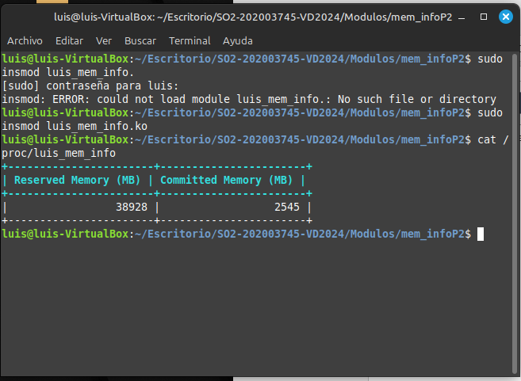

# Proyecto 2 Asignador de memoria

Un **asignador de memoria** (o **gestor de memoria**) es un componente del sistema operativo o una librería que se encarga de administrar la memoria dinámica en un programa. Tiene como función principal es proporcionar a las aplicaciones bloques de memoria cuando lo necesitan y liberar esa memoria cuando ya no se usa, asegurando un uso eficiente de los recursos disponibles.

## Resumen del proyecto

El proyecto tiene como objetivo el desarrollo de una nueva variante en la familia de asignadores de memoria, denominada **tamalloc**, que asegura la inicialización de la memoria en 0 sin marcar toda su memoria como utilizada de inmediato. Esta variante inicializa las páginas pertenecientes a la memoria reservada una por una según sean accedidas, lo que permite que la memoria en estado RSS no se dispare de inmediato. Esto contribuye a mantener la memoria sin páginas físicas inmediatamente, permitiendo al sistema un mejor manejo del over-commit.

## Implementación de tamalloc con lazy-zeoring

Antes de explicar la implementación de tamalloc, se dará una breve explicación de como funciona malloc.

- **Malloc**: En programación en C, **`malloc`** (de **memory allocation**, o **asignación de memoria**) es una función que se utiliza para asignar memoria dinámica en el heap durante la ejecución del programa. La memoria asignada con `malloc` puede ser utilizada para almacenar datos mientras dure el programa.

En palabras simples, podemos relacionar malloc con el siguiente ejemplo

Imagina que estás en una tienda de muebles y quieres comprar una mesa para tu oficina. La tienda tiene varios tamaños de mesas disponibles, pero no sabes exactamente cuál necesitas. Entonces, le pides al encargado una mesa del tamaño que consideres adecuado para tu oficina en ese momento.

El encargado de la tienda, al recibir tu solicitud, va al almacén y selecciona una mesa del tamaño que pediste. Te la lleva y te la entrega para que la utilices. Sin embargo, la mesa está vacía: no tiene ningún contenido o muebles en ella, simplemente es una mesa libre de elementos.

### Relación con `malloc`

- **La tienda**: Representa el sistema operativo.
- **El encargado**: Es el proceso que gestiona la memoria (en este caso, el sistema operativo).
- **La mesa**: Representa el bloque de memoria.
- **El tamaño que pides**: Es el número de bytes que deseas asignar.

Una vez claros con los conceptos de que es un asignador de memoria, podemos explicar la implementación y como funciona tamalloc.

### Tamalloc

```c
SYSCALL_DEFINE2(luis_tamalloc, size_t, size, unsigned long __user *, addr)
{
    unsigned long user_addr;


    size = PAGE_ALIGN(size);


    user_addr = vm_mmap(NULL, 0, size, PROT_READ | PROT_WRITE, MAP_PRIVATE | MAP_ANONYMOUS | MAP_NORESERVE, 0);
    if (IS_ERR_VALUE(user_addr)) {
        return user_addr;
    }

    // Copiar la dirección de memoria asignada al espacio de usuario
    if (copy_to_user(addr, &user_addr, sizeof(user_addr))) {
        vm_munmap(user_addr, size);
        return -EFAULT;
    }

    return 0;
};


static vm_fault_t tamalloc_page_fault_handler(struct vm_fault *vmf)
{
    struct page *page;
    void *page_addr;


    page = alloc_page(GFP_KERNEL);
    if (!page)
        return VM_FAULT_OOM;


    page_addr = page_address(page);
    memset(page_addr, 0, PAGE_SIZE);


    vmf->page = page;

    return 0;
};

static const struct vm_operations_struct tamalloc_vm_ops = {
    .fault = tamalloc_page_fault_handler,
};
```

En el primer proyecto se hizo una explicación de como se implementan las syscalls, y sus definiciones, así que en esta documentación no se profundizará en este tema.

#### Términos importantes en el código y su respectiva explicación

```c
size = PAGE_ALIGN(size);
```

**`PAGE_ALIGN(size)`**: Alinea el tamaño de la memoria al tamaño de una página de memoria. Las páginas de memoria suelen tener un tamaño fijo, como 4KB o 8KB. Esto asegura que el tamaño solicitado sea un múltiplo de este tamaño de página, lo cual es importante para la administración de memoria en el sistema operativo.

```c
user_addr = vm_mmap(NULL, 0, size, PROT_READ | PROT_WRITE, MAP_PRIVATE | MAP_ANONYMOUS | MAP_NORESERVE, 0);
```

**`vm_mmap`**: Es una función del núcleo de Linux que asigna memoria al proceso. En este caso, se está pidiendo un bloque de memoria de tamaño `size` con permisos de lectura y escritura.

- **`NULL`**: El primer parámetro es `NULL` porque no se está pasando una dirección específica; se le deja al sistema decidir la dirección de inicio.
- **`0`**: El segundo parámetro, que es 0, le dice al sistema que no tiene que inicializar un valor de dirección.
- **`PROT_READ | PROT_WRITE`**: Define los permisos de la memoria, en este caso, se le da permiso para leer y escribir.
- **`MAP_PRIVATE | MAP_ANONYMOUS | MAP_NORESERVE`**:
  - **`MAP_PRIVATE`**: La memoria asignada no será compartida entre procesos.
  - **`MAP_ANONYMOUS`**: La memoria no se conecta a un archivo, es solo un bloque de memoria anónima.
  - **`MAP_NORESERVE`**: No reserva físicamente la memoria, lo que significa que no se asignan páginas de memoria reales hasta que se accede a ellas.

### Fallos de página

Las estructuras que ves (`vm_fault_t`, `vm_operations_struct`, `tamalloc_page_fault_handler`) no mencionan explícitamente a `tamalloc`, pero están relacionadas con la forma en que funciona la gestión de memoria en el sistema operativo, y especialmente con cómo se maneja la **asignación perezosa de memoria** (o "lazy allocation"), que es parte de la implementación de `tamalloc`.

A continuación se desglosará como se relacionan con tamalloc y que tan importantes son estas funciones.

```c
static vm_fault_t tamalloc_page_fault_handler(struct vm_fault *vmf)
{
    struct page *page;
    void *page_addr;

    // Asignación de una nueva página de memoria
    page = alloc_page(GFP_KERNEL);
    if (!page)
        return VM_FAULT_OOM;  // Error si no hay suficiente memoria

    // Obtener la dirección de la página asignada
    page_addr = page_address(page);
    // Inicializar la página a cero
    memset(page_addr, 0, PAGE_SIZE);

    // Establecer la página en el fallo de página
    vmf->page = page;

    return 0;  // Indica que se manejó el fallo correctamente
};
```

**`tamalloc_page_fault_handler`**: Esta es la función que maneja el fallo de página. Cuando el proceso intenta acceder a una página de memoria que no ha sido inicializada, esta función:

1. Asigna una nueva **página de memoria** (usando **`alloc_page`**).
2. **Inicializa** esta página con ceros (`memset`), como parte del comportamiento de `tamalloc` para asegurar que las páginas sean inicializadas solo cuando se acceden por primera vez.
3. **Asocia** esta página recién asignada al fallo de página (`vmf->page`), lo que le dice al sistema que esta página ahora está disponible para el proceso.

Si no hay suficiente memoria disponible para asignar una nueva página, la función devuelve un error **`VM_FAULT_OOM`** (fuera de memoria).

Estas estructuras y funciones son parte de la **implementación de la asignación perezosa** de `tamalloc`. La idea es que la memoria no se asigna ni se inicializa hasta que el proceso realmente la necesita. Cuando ocurre un fallo de página (es decir, cuando el proceso intenta acceder a una página de memoria no inicializada), el **manejador de fallos de página** (`tamalloc_page_fault_handler`) se activa y asigna la memoria solo en ese momento.

El sistema operativo usa un mecanismo llamado **fallo de página** (page fault) para detectar cuando un programa intenta acceder a una parte de la memoria que aún no se ha asignado físicamente.

### Ejemplo sencillo de cómo funciona el manejador de fallos de página

1. **Petición de memoria**:
   
   - Supongamos que se tiene un programa que pide memoria usando `tamalloc`. Digamos que el programa necesita 4 KB de memoria.
   - El sistema **no asigna inmediatamente esa memoria física** en RAM. Solo marca esa memoria como "reservada" en el espacio virtual del programa, pero no la carga en la memoria RAM.

2. **Acceso a la memoria (Causa de un fallo de página)**:
   
   - Ahora, el programa intenta **acceder a esa memoria**. Puede ser, por ejemplo, intentando escribir un valor en esa dirección de memoria.
   - En este punto, como el sistema no ha asignado aún físicamente esa memoria (es decir, aún no está en la RAM), ocurre un **"fallo de página"**.

3. **Manejo del fallo de página**:
   
   - El sistema detecta que el programa intentó acceder a una parte de memoria que aún no existe en la RAM. Entonces, se activa el **manejador de fallos de página**, que es la función **`tamalloc_page_fault_handler`**.
   - Esta función se encarga de:
     1. **Asignar una nueva página de memoria física**.
     2. **Inicializarla a cero** (en el caso de `tamalloc`, ya que la memoria debe empezar vacía).
     3. **Dar esa página al proceso**, lo que significa que el proceso ahora puede seguir usando esa parte de memoria.

Con esta explicación se dieron los conceptos fundamentales para entender el uso y funcionamiento de tamalloc.

## Funcionamiento de tamalloc


En términos generales, lo que hace **tamalloc** es una **asignación de memoria perezosa**, donde la memoria no se asigna físicamente en el momento de la solicitud, sino que se asigna solo cuando se accede a ella. Esto ayuda a optimizar el uso de la memoria y el manejo del over-commit del sistema.

Basado en la salida que compartiste, aquí hay un desglose de lo que sucede a un nivel más general:

1. **Solicitud de memoria:**
   
   - El programa solicita **10 MB** de memoria utilizando `tamalloc`. En este punto, la memoria no se asigna de inmediato. En lugar de eso, **el sistema marca esa memoria como "reservada"** en el espacio de direcciones del proceso. No hay memoria física asignada aún.

2. **Dirección asignada:**
   
   - Una vez que el sistema ha marcado la memoria como reservada, se devuelve la dirección donde **esa memoria virtual está reservada** para el programa (en este caso, la dirección `0x71f449400000`). Es importante notar que esta dirección es virtual, no física. Aún no hay memoria RAM asignada.

3. **Acceso a la memoria (activación de la asignación perezosa):**
   
   - Cuando el programa empieza a **leer la memoria byte por byte**, es en este momento cuando **la asignación perezosa entra en acción**. El primer acceso a una dirección de memoria que estaba reservada pero no asignada físicamente **provoca un fallo de página**, lo que hace que el sistema operativo asigne físicamente esa memoria en RAM.
   - **El fallo de página** activa el manejador que asigna la memoria física solo cuando el programa realmente intenta usarla, lo que ahorra recursos si nunca se accede a esa memoria.

4. **Verificación de la inicialización:**
   
   - Después de que la memoria se asigna, el programa verifica que cada byte de la memoria está **inicializado a cero**. Como el sistema está configurado para inicializar la memoria a cero en el momento del fallo de página, el programa confirma que la memoria está **correctamente inicializada en cero**.
   - Cada vez que el programa verifica 1 MB de memoria, se imprime un mensaje indicando que ese segmento ha sido verificado.

5. **Escritura en la memoria:**
   
   - El programa luego escribe valores aleatorios en la memoria, lo que indica que ahora está usando activamente esa memoria asignada.

6. **Verificación final:**
   
   - Al final, el programa confirma que toda la memoria solicitada ha sido correctamente inicializada a cero y luego escrita.

# Implementación de módulos del kernel

Para cada proceso individual se implemento el siguiente módulo

Para CADA proceso individual:

- Memoria reservada (Reserved) (en KB/MB)

- Memoria utilizada (Commited) (en KB/MB, y en % de memoria reservada)

- OOM SCore

Y otro módulo aparte para

resumen de TODOS los procesos:

- Memoria total reservada (Reserved) (en MB)

- Memoria total utilizada (Commited) (en MB)

A continuación se mostrarán capturas de como funciona cada uno de estos módulos.

## Módulo individual por cada proceso

El funcionamiento del módulo es el siguiente:

```c
static int meminfo_show(struct seq_file *m, void *v) {
    struct sysinfo si;
    struct task_struct *task;

    si_meminfo(&si);
    unsigned long total_reserved = si.totalram * 4; // Convertir páginas a KB

    seq_printf(m, "Total Reserved Memory (KB): %lu\n", total_reserved);
    seq_printf(m, "+-------+-----------------+---------------------+---------------------+--------------+---------------+\n");
    seq_printf(m, "|  PID  |       Name      | Reserved Memory(KB) | Committed Memory(KB) | Mem Usage (%%) | OOM Score Adj |\n");
    seq_printf(m, "+-------+-----------------+---------------------+---------------------+--------------+---------------+\n");

    for_each_process(task) {
        if (target_pid != 0 && task->pid != target_pid) {
            continue;
        }

        unsigned long vsz = 0;
        unsigned long rss = 0;
        unsigned long mem_usage = 0;
        long oom_score_adj = 0;
        struct mm_struct *mm = task->mm;

        if (mm) {
            vsz = mm->total_vm << (PAGE_SHIFT - 10); // Convertir páginas a KB
            rss = get_mm_rss(mm) << (PAGE_SHIFT - 10); // Convertir páginas a KB
            mem_usage = calculate_percentage(rss, total_reserved);
        }

        oom_score_adj = task->signal->oom_score_adj;

        seq_printf(m, "| %5d | %-15s | %19lu | %19lu | %11lu.%02lu%% | %13ld |\n",
                   task->pid, task->comm, vsz, rss, 
                   mem_usage / 100, mem_usage % 100, oom_score_adj);
    }

    seq_printf(m, "+-------+-----------------+---------------------+---------------------+-----------------+---------------+\n");
    return 0;
}

static int meminfo_open(struct inode *inode, struct file *file) {
    return single_open(file, meminfo_show, NULL);
}

static ssize_t meminfo_write(struct file *file, const char __user *buf, size_t count, loff_t *pos) {
    char input[10];

    if (count > 9) {
        return -EINVAL;
    }

    if (copy_from_user(input, buf, count)) {
        return -EFAULT;
    }

    input[count] = '\0';

    if (input[0] == '0' && input[1] == '\0') {
        target_pid = 0;
    } else {
        sscanf(input, "%d", &target_pid);
    }

    return count;
}
```

- Este módulo del kernel proporciona un informe detallado del uso de memoria en el sistema, mostrando datos como memoria reservada, memoria comprometida, porcentaje de uso y el ajuste de puntuación OOM de cada proceso en un archivo virtual dentro del sistema de archivos `/proc`.

- Recorre todos los procesos activos del sistema o filtra por un PID específico, calculando la memoria virtual total (VSS), memoria física usada (RSS) y el porcentaje de memoria utilizada en relación con la memoria total reservada. La información se presenta en una tabla formateada.

- Los usuarios pueden interactuar escribiendo en el archivo un PID para filtrar los datos de un proceso específico o "0" para reiniciar y mostrar información de todos los procesos, permitiendo ajustar dinámicamente la consulta sin reiniciar el módulo.

### Captura de funcionamiento del módulo

Si se manda como parametro el número 0:


### Funcionamiento en conjunto con tamalloc


La memoria reservada y committed memory iran cambiando según el test de tamalloc lo solicite.

## Módulo 2 (Resumen de todos los procesos)



Este módulo es el encargado de realizar un resumen de todos los procesos y mostrar la memoria reservada y el committed memory de estos.

#### Aclaraciones

**¿ Por qué la memoria reservada es mayor que la ram de mi máquina virtual?**

La suma de la memoria reservada (VSS) de todos los procesos es mayor que la RAM asignada porque el sistema operativo usa una técnica llamada *overcommit*, que permite a los procesos reservar más memoria virtual de la que realmente existe en RAM. Esto incluye memoria compartida (como bibliotecas que usan varios procesos), memoria mapeada a disco o swap, y áreas reservadas pero no usadas físicamente hasta que se acceden. Así, la memoria reservada refleja todo el espacio virtual asignado, mientras que solo una parte de esta está respaldada por RAM en uso (RSS).

**¿Qué es la committed memory?**

La **Committed Memory** es la cantidad de memoria que el sistema ha garantizado a los procesos y que está respaldada por recursos reales, ya sea en RAM o en swap. Representa la memoria que los procesos han solicitado y que el sistema operativo ha comprometido para su uso, asegurando que estará disponible cuando los procesos la necesiten. A diferencia de la memoria reservada (VSS), la committed memory incluye solo la memoria que se ha utilizado o está lista para ser utilizada, no el total de la memoria virtual asignada.

## Errores encontrados

- Encontré un error al usar `do_mmap` en mi syscall personalizada debido a que no pasaba correctamente los argumentos requeridos por esta función interna, lo que impedía la asignación de memoria. Para solucionarlo, lo reemplacé por `vm_mmap`, una función más accesible que encapsula la lógica de `do_mmap` y maneja la asignación de memoria en el espacio de usuario de forma más sencilla, aceptando parámetros como las protecciones de página, el tipo de mapeo y el tamaño alineado a páginas.

- Durante las pruebas, encontré un error en el que los fallos de página no se manejaban correctamente, lo que causaba accesos inválidos y errores de segmentación cuando un proceso intentaba usar la memoria asignada con la syscall. El problema se debía a que, en el controlador de fallos de página (`tamalloc_page_fault_handler`), olvidé asignar la página creada al campo `vmf->page`. Esto impedía que el sistema asociara correctamente la página física con la dirección virtual que generó el fallo.

## Cronograma para la realización del proyecto

| **Fecha**    | **Actividad**                                                               |
| ------------ | --------------------------------------------------------------------------- |
| Jueves 19    | Investigación de como funciona malloc y que es un alojador de memoria en C. |
| Viernes 20   | Implementación de tamalloc.                                                 |
| Sábado 21    | Verificación del funcionamiento de tamalloc y arreglo de algunos errores.   |
| Domingo 22   | Pruebas y realización de los 2 módulos del kernel.                          |
| Lunes 23     | Inicio de la documentación y arreglo de algunos detalles.                   |
| Martes 24    | Finalización de la documentación.                                           |
| Miércoles 25 | Feliz navidad :christmas_tree:                                              |

# Reflexión personal

Mediante la realización de este proyecto, pude aprender muchas cosas nuevas, entre ellas están las siguientes:

- Como funciona un alojador de memoria.

- Que es el overcommit, y que los procesos suelen reservar espacio pero no usarlo todo en su totalidad.

- Como funciona la memoria dinámica.

Debido a que nunca me había adentrado en temas de memoria y procesos, para mi este proyecto fue una buena oportunidad para poder aprender estos temas, y poder saber como funciona el sistema operativo en la gestión de procesos. Para mi este proyecto fue muy impresionante, también porque implementamos nuestro propio alojador de memoria, y como lo mencione anteriormente, esto me ayuda bastante a poder saber más sobre el basto mundo que hay en los temas del kernel,  fue un buen paso para poder aprender sobre el kernel de linux, y adquirir más conocimiento para poder formarme como el ingeniero que seré en un futuro.
