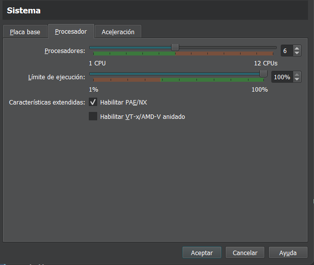

# SO2-202003745-VD2024

## Descripción del proyecto

En el ámbito de los sistemas operativos, la capacidad de personalizar y expandir el kernel permite a los desarrolladores ajustar el funcionamiento del sistema a necesidades específicas.
Este proyecto aborda el desarrollo de nuevas funcionalidades en el kernel de Linux, brindando la oportunidad de entender su estructura y funcionamiento interno, además de aprender a trabajar con módulos y llamadas al sistema personalizadas.

Las personalizaciones estarán limitadas a aspectos específicos como la modificación
del nombre del sistema, mensajes de arranque y el desarrollo de módulos para obtener estadísticas del sistema. No se espera una modificación extensa del sistema operativo ni el desarrollo de nuevas arquitecturas o drivers avanzados.

## Requisitos del proyecto

- Entorno de ejecución para máquinas virtuales

- Linux mint 

## Configuración del entorno para la realización del proyecto

Para poder realizar este proyecto, se hizo uso de una máquina virtual, la cual tiene linux mint (versión cinamon), a continuación se explicará cuál es la mejor configuración para poder realizar este proyecto correctamente.

#### Configuración para la maquina virtual

Se recomienda darle los siguientes requisitos a la máquina virtual:




Para evitar cualquier inconveniente también se recomienda darle un tamaño de 40gb, así podremos compilar el kernel perfectamente. 

#### Versión del kernel

Para realizar este proyecto se descargo la versión *6.8*, la cual fue descargada en kernel.org.

#### Recomendación para copiar y pegar

Para poder copiar entre nuestra máquina host y anfitrion, existen dos opciones.

- Conectase mediante ssh.

- Instalar guest additions de vbox.

# Compilar el kernel (Si es por primera vez)

## Descargar y descomprimir el código fuente del kernel

```bash
wget https://cdn.kernel.org/pub/linux/kernel/v6.x/linux-6.8.tar.xz
```

Descargar el archivo del kernel desde `kernel.org`.

```bash
tar -xvf linux-6.8.tar.xz
```

Descomprimir el archivo descargado.

---

## Instalar las dependencias necesarias

```bash
sudo apt-get install build-essential libncurses5-dev fakeroot wget bzip2 openssl
sudo apt-get install build-essential libncurses-dev bison flex libssl-dev libelf-dev
```

Instalar las herramientas y librerías requeridas para compilar el kernel.

---

## Preparar el entorno de compilación

Ejecutar los siguientes comandos en el directorio del código fuente del kernel como usuario root:

### Copiar el archivo de configuración existente

```bash
cp -v /boot/config-$(uname -r) .config
```

Copiar la configuración actual del kernel al directorio de compilación.

### Limpiar el ambiente de compilación

```bash
make clean
```

Eliminar archivos generados previamente en caso de haberlos.

### Modificar la versión del kernel en el archivo Makefile

Editar el archivo `Makefile` en la raíz del directorio del código fuente y modificar la línea:

```make
EXTRAVERSION =
```

Cambiándola a algo como:

```make
EXTRAVERSION = -49-usac1
```

Esto agrega una etiqueta personalizada a la versión del kernel.

---

## Configurar el kernel

### Crear la configuración inicial basada en el archivo copiado

```bash
make oldconfig
```

Se recomienda presionar **Enter** en todas las opciones que aparezcan.

### Crear configuraciones locales para los módulos

```bash
make localmodconfig
```

Esto optimiza el kernel configurando sólo los módulos necesarios para el hardware presente en la máquina.

### Deshabilitar certificados de firma oficiales de Canonical

```bash
scripts/config --disable SYSTEM_TRUSTED_KEYS
scripts/config --disable SYSTEM_REVOCATION_KEYS
```

Esto deshabilita las claves de firma que podrían generar problemas durante la compilación.

---

## Compilar e instalar el kernel

### Crear un script para compilar e instalar

Ejecutar el archivo `compile_and_install.sh` 

Marcar el archivo como ejecutable:

```bash
chmod +x compile_and_install.sh
```

Ejecutar el script:

```bash
./compile_and_install.sh
```

Presionar **Enter** en todas las opciones de configuración que aparezcan durante el proceso.

---

## Finalizar la instalación

Si el script no actualiza automáticamente la configuración del gestor de arranque, ejecutar:

```bash
sudo update-grub2
```

Reiniciar la máquina virtual. Mantener presionada la tecla **Shift** al iniciar para acceder al menú del gestor de arranque y seleccionar el nuevo kernel.

---

## Debug

Si el kernel no aparece en la lista del gestor de arranque o no inicia, intentar:

```bash
sudo update-grub2
```

## 1.2 Reecompilar el kernel

Para volver a compilar el kernel, no es necesario volver a realizar todos los pasos, lo único para volver a compilar el kernel, cuando hayamos hecho cambios, solo debe ejecutarse el archivo compile.sh.

# 2. Código fuente del kernel modificado

## 2.1 Personalización del nombre del sistema

Para la personalización del nombre del sistema, es necesario irse al siguiente archivo: 

```
/home/luis/Escritorio/linux-6.8/include/linux
```

Una vez en ese archivo, mostrará el siguiente contenido:

```C
/* SPDX-License-Identifier: GPL-2.0 */
#ifndef _LINUX_UTS_H
#define _LINUX_UTS_H

/*
 * Defines for what uname() should return 
 */
#ifndef UTS_SYSNAME
#define UTS_SYSNAME "Linux"
#endif

#ifndef UTS_NODENAME
#define UTS_NODENAME CONFIG_DEFAULT_HOSTNAME /* set by sethostname() */
#endif

#ifndef UTS_DOMAINNAME
#define UTS_DOMAINNAME "(none)"    /* set by setdomainname() */
#endif

#endif
```

Para cambiar el nombre debemos cambiar la siguiente línea:

```
#define UTS_SYSNAME "Linux"
```

al nombre que queremos cambiar, por ejemplo:

```
#define UTS_SYSNAME "Linux SO2_USAC"
```

Una vez realizado estos pasos, volviendo a recompilar debe salirnos el nombre del sistema al que cambiamos.

## 2.2 Mensajes personalizados

Para poder mostrar mensajes personalizados en nuestro kernel al momento del arranque del sistema debemos modificar el archivo que se encuentra en la siguiente ruta:

```
/home/luis/Escritorio/linux-6.8/init/main.c
```

Una vez en este archivo, buscaremos la función start_kernel, una vez hayamos encontrado esa función, modificaremos lo que queremos que nos salga al inicio, por ejemplo debería de quedar una función como se muestra en la siguiente imagen:


Una vez realizado estos pasos, con el comando 

```bash
dmesg 
```

nos debe salir al inicio el mensaje personalizado que introdujimos, de la siguiente manera:

